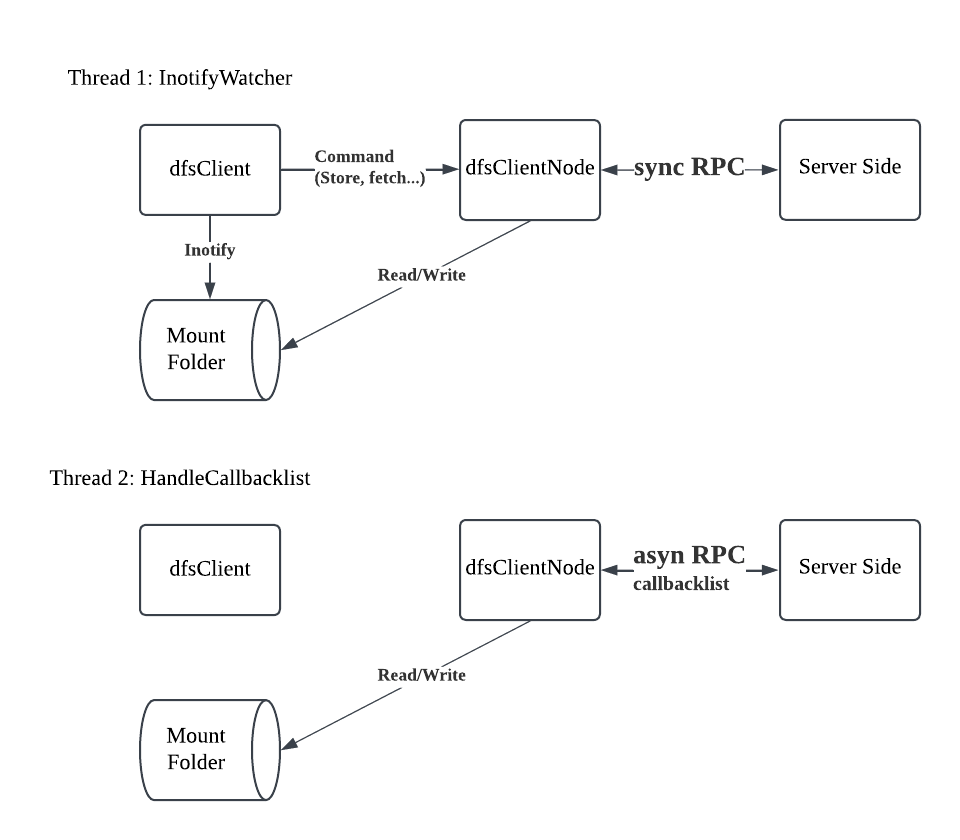
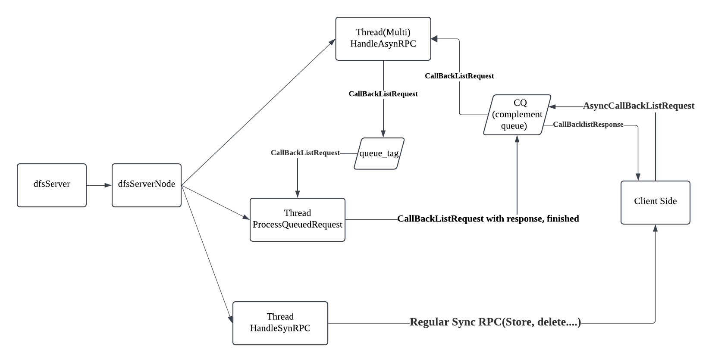
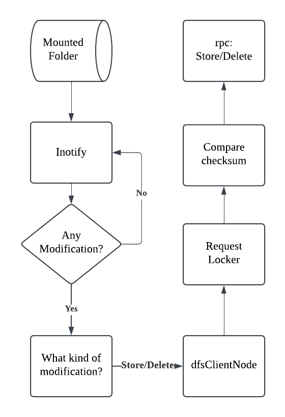
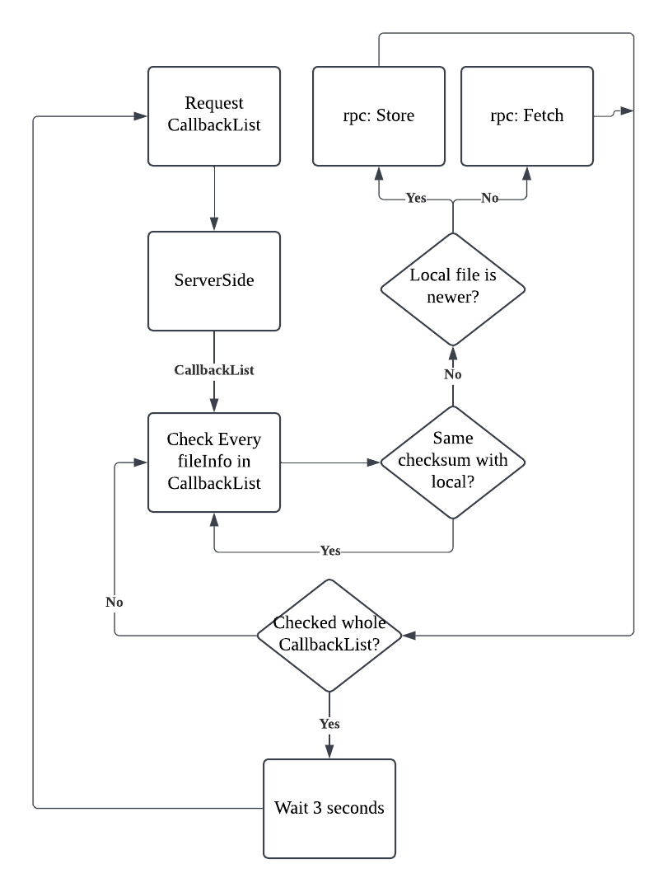
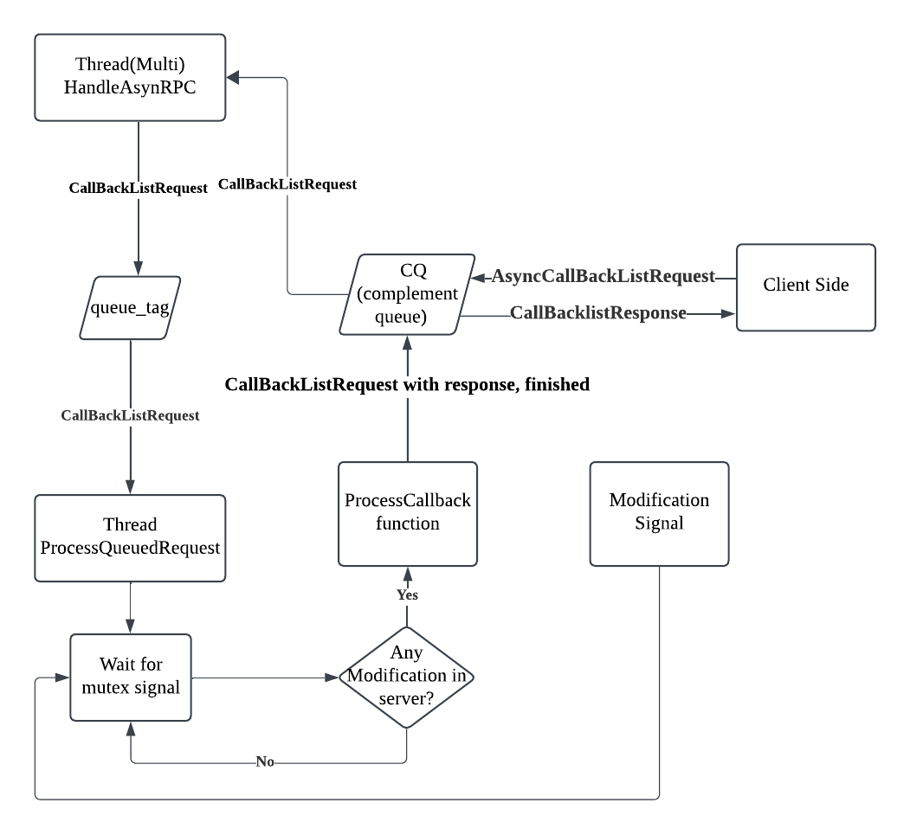
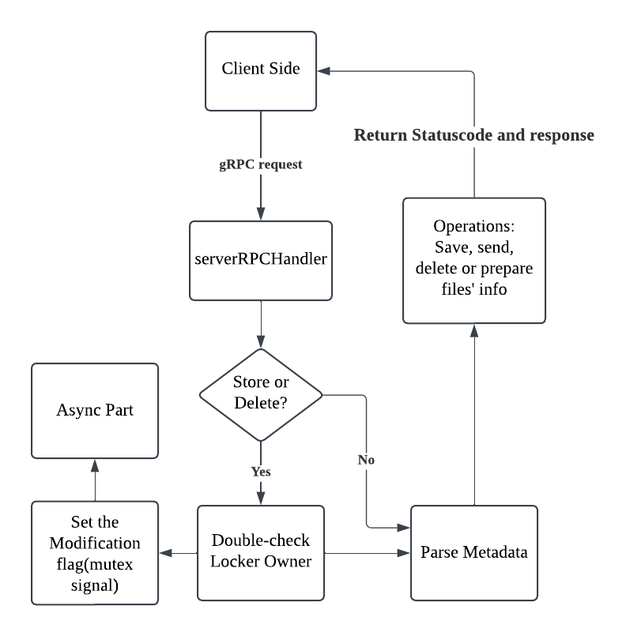
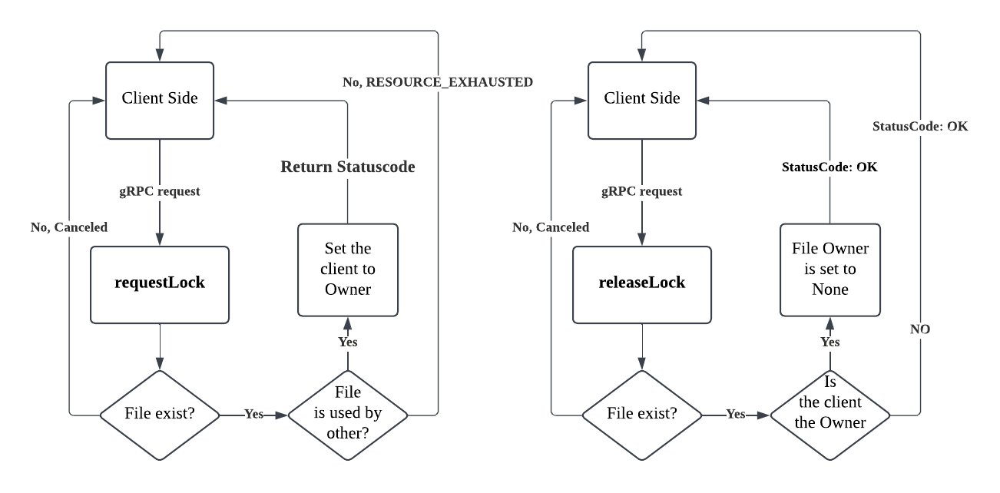

# 1. The design of the Project

Overall, this project is a multithreaded Distributed File System (DFS) implemented using `gRPC`. The server is neither fully asynchronous nor synchronous but a **hybrid design**. An **asynchronous thread** handles `CallbackList` requests(see section 1.3), while **synchronous threads** manage all other operations.

## 1.1 The design of the rpc

### 1.1.1 Same operations with [part 1](https://github.com/90yearsoldcoder/Remote-file-system)

```
    rpc storeFile(stream FileChunk) returns (ResponseStatus){}
    rpc fetchFile(FilePath) returns (stream FileChunk){}
    rpc listFiles(ListFilesRequest) returns (LSResponse){}
    rpc statusFile(FilePath) returns (FileStatus){}
    rpc deleteFile(FilePath) returns (ResponseStatus){}
```

Those rpc operations in `proctocal buffer` are exactly the same with part 1

### 1.1.2 rpc: Locker / unLocker

```
rpc requestLock(LockerInfo) returns (ResponseStatus){}
rpc releaseLock(LockerInfo) returns (ResponseStatus){}
message LockerInfo{
    string path = 1;
    string clientId = 2;
}
```

When a client intends to store/modify/delete a file on server, it must to request a locker first(`requestLock`). Only when the locker belongs to the client, the client has right to do the modification on the file. After the modification, it should release the lock(`releaseLock`).

### 1.1.3 rpc: compare two files

```
rpc compareFile(FileCRC) returns (compareRes){}
```

Client will send a `FileCRC` containing filename and its CRC(checksum) to server, asking the server to compare the files between local and server. If the two files are the same, it will return `compareRes` with `true` flag; vice versa, it returns `false`.

### 1.1.4 rpc: CallbackList

```
rpc CallbackList(ListFilesRequest) returns (LSResponse){}
```

From gRPC's perspective, it is the same as `rpc: listFiles`, as both send back a list of files' information. However, the key difference is that this operation is handled by an `asynchronous thread`, whereas `listFiles` may not be. We will discuss more about this in **section 1.3**

## 1.2 The design of the client



- Overrall, there are two threads in client;
- The first thread monitors the mounted folder on hard disk. If any operation occurs in the mounted folder, it will prompt `dfsClientNode` to update the change to `Server`
- The second thread continuously sends `callbacklist` requests to server, in order to acquire the `latest file list` from server. Then, according to the `list`, it will update the mounted folder.
- **Note1:** For the efficiency purpose, the `dfsClientNode` sent `callbacklist` request every 3 seconds.
- **Note2:** Since the two threads might operate the `mounted folder` at the same time which is very dangerous, I set a mutex in the both functions `InotifyWatcherCallback()` and `HandleCallbackList()`
  ```
  std::lock_guard<std::mutex> lock(clientNode_locker);
  ```
- **Note3:** It is highly likely that, after `thread 2` updates the `mounted folder`, the `thread 1` detects the modification in `mounted folder`, potentially causing both threads reapeatedly update the same content. So, in my design, `dfsClientNode` will only update the file with different `sumcheck`. Any other operations, such as `Store`, will only proceed when the `sumcheck` are different between client and server.

## 1.3 The design of the server



### 1.3.1 The Async part of the server

- The client sents the `CallbacklistRequest` to server, and be saved to `CQ`
- `HandleAsynRPC` threads will take the `CallbacklistRequest` out from `CQ`, and push it into `queue_tag`
- `ProcessQueuedRequest` which is a single thread, retrieves the `CallbacklistRequest` message from `queue_tag` at an appropriate time. Here the appropriate time refers to **any moment when a modification made in server**
- After `ProcessQueuedRequest` handles the request, it gives the `finished` to the request, and push it to `CQ`.
- Then the `CQ` will send the response to Client side

### 1.3.2 The Regular Sync RPC

- They are almost the same as `part1`.
- Some of the RPCs(e.g. store, fetch) have a special checksum part, to avoid repeated operations in server. We will discuss in next section.
- Some RPCs will double-check the locker owner. This is not necessary, just for network safety.

# 2. Flow Control

## 2.1 Flow control for inotifyWatcher in Client



- **Note1:** The Store/Delete rpc is the same with part 1, so the details are not provided.
- **Note2:** For `Store` command, if the checksum is the **same**, then **give up**.
- **Note3:** For `Delete` command, if the checksum is **not same**, then **give up**. Because we only need to delete the file same with our local, otherwise, we do not need to care about it.

## 2.2 Flow control for HandleCallbackList in Client



- **Note:** The CallbackList part is asynchronous, its results are retrieved from the Completion Queue (CQ). In the figure above, I have omitted the CQ to simplify the visualization and make it easier to understand.

## 2.3 Flow control for AsyncCallbackList in Client



- **Note:** The `ProcessCallback` function is almost the same as the `List` in Part 1.

## 2.4 Flow control for Regular SyncRPC in Server



- **Note1:** The operations are same with `Part 1`
- **Note2:** If it is `Store` or `Delete` request, it will re-set the modification mutex signal, which allows the `2.3 AsyncCallbackList` to run.

## 2.5 Flow control for request/release locker in Server



# 3. Implementation

To compile

```
make protos
make part2
```

To run the server

```
./bin/dfs-server-p2 <mount_path>
```

To run the client

```
./bin/dfs-client-p2 mount <path>
```

# 4. Test

- Basic Tests are the same with part1
- Mounted folder Tests are followed

## 4.1 Test async part

```
# Terminal 1
./bin/dfs-server-p2 /tmp/mnt/server
# Terminal 2
./bin/dfs-client-p2 mount /tmp/mnt/client1
# Terminal 3
./bin/dfs-client-p2 mount /tmp/mnt/client2
```

Then copy file to /tmp/mnt/client1

```
cp testfile.txt /tmp/mnt/client1
```

`testfile.txt` will appear in both `/tmp/mnt/server` and `/tmp/mnt/client1`

## 4.2 Test Locker part

```
cp largefile1.txt /tmp/mnt/client1 & cp largefile2.txt /tmp/mnt/client2
```

`largefile.txt` is larger than 1 GB.
Debug log will show a `RESOURCE_EXHAUSTED` in one of the client.
